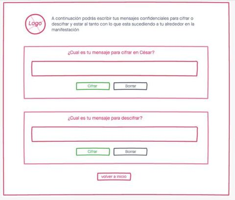
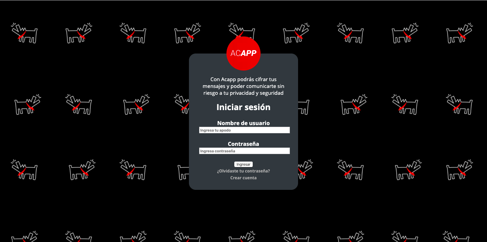
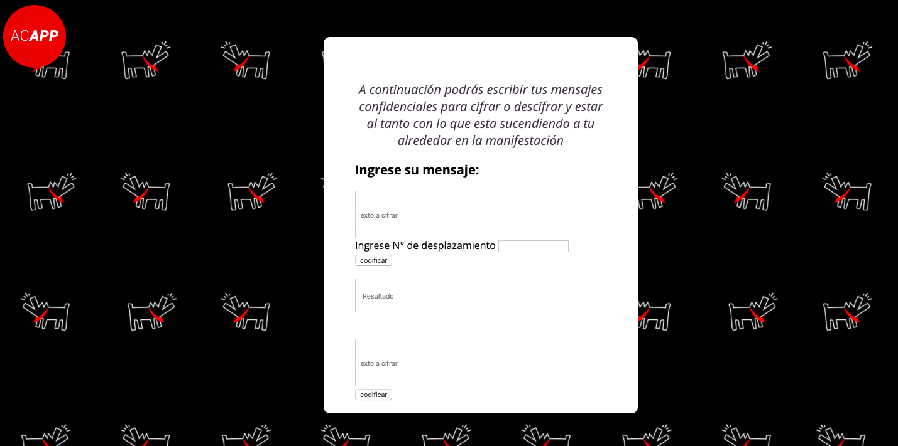

### ACAPP

### Definición del producto

En este proyecto trabajamos en dupla, pensando en como ayudar a comunicarse a 
los participantes de la primera línea, protegiendo la informacion que recibiran.

Se comienza con un inicio de sesión donde se pide nombre de usuario (apodo) y contraseña, luego se hace click en boton ingresar.
Se abre una nueva ventana y aparece una invitacion a ingresar el mensaje en la caja de texto.
Este mensaje se puede cifrar o decifrar, para lo cual se va a utilizar el alfabeto ascii que funciona ingresando el numero de 
desplazamiento y asi obtener la codificacion del mensaje.
Luego de ingresar el número se debera clickear el botón cifrar o decifrar.
Y se obtendrá el mensaje final cifrado o descifrado en una caja de texto.

* ¿Quiénes son los principales usuarios de producto?

 	Los llamados "primera linea" en las manifestaciones (personas que se posicionan 
  lo más cerca al área de conflicto del personal y el equipo de una fuerza armada).
  

* ¿Cuáles son los objetivos de estos usuarios en relación con tu producto?

  Enviar y recibir mensajes secretos entre los participantes de la "primera linea".
  

* ¿Cómo crees que el producto que estás creando está resolviendo sus problemas?

  Porque cifra el mensaje de forma que solo el emisor y receptor lo entienda, y así, 
  cualquier persona ajena que acceda a las conversaciones no logre descifrar esta.
  
   ### Prototipado
   
   
   
  
  ### Imagen final del proyecto
  
  
   
  
